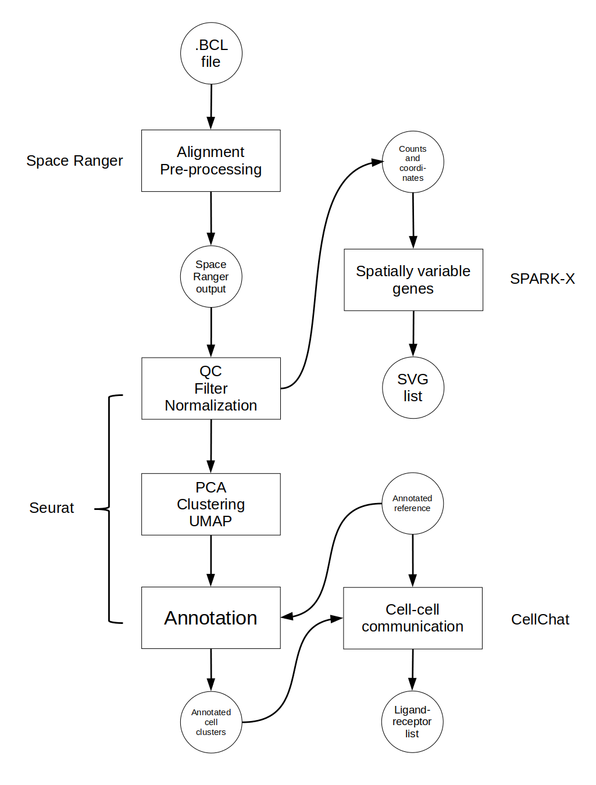

```{r setup, include=FALSE}
knitr::opts_chunk$set(echo = TRUE)
```

# Welcome!
Future home of a simple, (hopefully) easy to understand spatial transcriptomics analysis pipeline for those who have never before done ST analysis.

This started as part of my masters thesis but has been continued as a way to provide some guidance to all of those trying to teach themselves a new NGS analysis techniques. The first version of this protocol will soon be published (pending link).

## Who is this NOT for
This protocol is not for anyone with extensive ST analysis experience. We will not be discussing intricate details or highly technical aspects beyond general notes to new users or "tips and tricks".

Conversely, this protocol is also not for someone completely new to next-generation sequencing (NGS), bioinformatics (BMI) analysis, or R. We will not be covering in detail datatypes, file handling, basic biological concepts involved with ST samples, or ST concepts prior to completed sequencing. There are places to find such information and repeating them here would be redundant and beyond the scope of this project. Instead, two good resources are [W3Schools](https://www.w3schools.com/r/default.asp) which will teach you the very basics of R and [DataQuest](https://www.dataquest.io/blog/learn-r-for-data-science/) which has more basics and also some simple projects where you can practice coding.

## So who is this actually for then?
The idea of this protocol is to run someone through their "first time" doing spatial transcriptomics analysis. Maybe you want to see if this is a new experiment type you would like to pursue in your lab. Maybe you just want to dabble in a new method to expand your BMI repertoire. If you want to take a simple data set and get a small hands-on experience with ST analysis, this is for you.

## Want to contribute?
The world of ST analysis is ever changing and constantly expanding. There is no guarantee this page or project will contain the most up to date information. This project is also currently managed by a single person in their spare time. If you would like to make updates, corrections, report problems, or suggest improvements, please feel free to do so using the issue tracker or discussion boards here on github or (if you are comfortable with git and coding) contributing directly to the repository.

There are several plans for the expansion of this protocol and they will be implemented as time allows. However, I hope you find this project helpful and informative in its current state.

## About this actual site
These pages are all written in R using a package called [Bookdown](https://bookdown.org/). This package allows you to write R scripts that can then be converted into html files. These files can then be uploaded to GitHub and published via GitPages. The R files are available for download on GitHub if you want a "behind the scenes" view of these pages or you want to run them without copy/pasting code from these pages.


At the bottom of every chapter, you will see output from `sessionInfo()`. This is a command in R that prints a list of current R environment infomration as well as packages that were loaded at the time of creating this page. While it is not necessary if you are creating simple webpages like this one, it is provided as part of the protocol as it can be useful in troubleshooting.

``` {r session_index}
sessionInfo()
```

<!--chapter:end:index.Rmd-->

# Introduction

``` {r set_options, echo = FALSE}
# This is a place to put any global options for creating this document
```

As biological technologies continue to advance, analysis methods that bring novel insight to the field are rapidly developing, including new ways to use already familiar techniques. RNA sequencing (RNA-seq) began with bulk methods that averaged expression across a sample. The next iteration used dissociation to disrupt tissue into single cells that could be sequenced individually (single-cell RNA-seq; scRNA-seq) to inform which genes were expressed in tandem in the same cell. Most recently, spatial information has been added to the analysis so now gene expression across a tissue sample can be reconstructed to give a 2D (or even 3D) picture. This new field is called spatial transcriptomics (ST).

ST analysis has a wide variety of applications. Starting at the sub-cellular level, imaging methods are able to localize RNA to specific parts of a cell to illuminate the structured handling of gene expression. At the cellular level, the distance between cells and the expression of ligand-receptor pairs are used to predict possible cell communication with greater accuracy. Finally, tissue-level datasets can inform the cellular makeup of a tumor sample or allow us to create a highly detailed tissue atlas with incredible resolution.

There are several methods for capturing RNA expression and spatial information from a tissue sample, one of the more popular options being 10X Genomics’ Visium platform. The Visium platform allows for capture of close to single-cell resolution whole transcriptome RNA-seq data while also noting the spatial position of cells in a tissue. Briefly, fresh frozen or formalin-fixed paraffin-embedded (FFPE) samples are fixed to a slide and stained with immunofluorescent (IF) markers or Hematoxylin and Eosin (H&E) stain before the slide is imaged. Tissue on the slide is then hybridized with whole-transcriptome probes and the slide is placed into a 10X Genomics CytAssist machine where areas of the tissue are captured and sequenced. Genomics’ Space Ranger software then converts raw data into an expression matrix and spatial coordinates. This platform is currently a popular choice and therefore this protocol will focus on analyzing data collected this way.

Although ST analysis pipelines may involve numerous steps, this chapter highlights three core components that are consistently implemented in widely used workflows.. The first is clustering which uses spatial and RNA-seq data to group sequencing spots by common gene expression profiles. These clusters can then inform tissue architecture and be used for spatial domain prediction. Next, spatially variable gene expression detection highlights which genes may vary in expression by location revealing structural domains or tissue heterogeneity. Cell-cell communication allows for the prediction of communication networks across a sample by assessing the distance between expression of ligand-receptor pairs in cells.

This protocol will focus on ST analysis with the three steps mentioned above. The software used at each step is one of a myriad of options and was chosen for ideal dataflow and ease of use. All are available as R packages therefore a familiarity with basic R functionality such as installing and loading R packages, handling R datatypes, and loading and saving data in R is advised.

## General Workflow

Figure 1 shows the general workflow of this pipeline along with the software for each step. The workflow is presented linearly here although the steps after clustering may be done in any order and several are optional depending on the desired analysis.



``` {r session}
sessionInfo()
```

<!--chapter:end:01-Introduction.Rmd-->


# Materials

Placeholder


## Computer Infrastructure
## Software
## Collect necessary files
### Space Ranger output
### Reference data
### Example datasets

<!--chapter:end:02-Materials.Rmd-->


# QC, Clustering, and Annotating with Seurat

Placeholder


## Import and QC
### Load in the data
### Trim and filter
### Normalization
## Visualize Gene Expression
## Dimention Reduction and Cluster
## Visualizing Clusters
## Spot Annotating
## Save the data

<!--chapter:end:03-Clustering.Rmd-->


# Spatially Variable Genes (SVGs) Discovery with SPARK-X

Placeholder


## Importing and Preparing Data
## Run SPARK-X
## Visualizing SVGs
## Save Data

<!--chapter:end:04-SVGs.Rmd-->


# Cell-Cell Communication with CellChat

Placeholder


## Importing Data and Setting Computer Options
## Preparing CellChat Object and Database
## Run CellChat
## Visualization

<!--chapter:end:05-CCC.Rmd-->

# Future Directions and Conclusion

``` {r set_options, echo = FALSE}
# This is a place to put any global options for creating this document
```

## Deconvolution

As this step is optional, it will not be covered here in detail. However, we did want to mention two R packages, RCTD and CARD that are useful for deconvolution. RCTD uses expression profiles from a reference dataset and supervised learning to determine cell type proportions in a spot. CARD uses a gene expression reference and spatial correlation to determine cell type at each spot across a tissue. Either package requires our Seurat object with spatial data and an annotated reference RNA-seq dataset appropriate for the tissue under study.

As we have RNA-seq data, analyses typically performed with these data can also be done here. Differential gene expression (DEG) is often performed. We can examine DEG per cell group defined in the clustering step or we can also compare expression in one cluster versus the rest of the cell population in the tissue. Seurat has methods to perform this analysis. Gene set enrichment analysis (GSEA) or a pathway analysis are also possible areas for further study.

## Conclusion

Spatial transcriptomics adds another level to RNA analysis, combining gene expression and location information. While we present a simple workflow with mostly default options, there are many nuances to ST analysis. For example, many software has the option to pre-process data before clustering yet there has been evidence that pre-processing can greatly affect analysis outcome18. Similarly, normalization can affect deconvolution and it is suggested only raw spatial data should be used. For SVGs and CCC, the list of results returned and their associated statistics greatly depends on the software and database choice respectively. It has been demonstrated in multiple studies that analysis performance is highly dependent on the dataset/software pairing and further algorithm refinement is necessary.

Here we focus on one platform and a handful of software for analysis but there are many options available. Visium is only one sequencing platform with other popular options being Slide-seq, MERFISH, seqFISH, Visium HD, and the emerging 10X Genomics Xenium. Each platform has its own pros and cons and offers slightly different analysis options. There are also many software options for each analysis step mentioned here. Again, each has distinct advantages and strengths depending on the dataset and sequencing platform. In the future, we would like to expand this protocol to make it applicable to a wider variety of platforms and analysis options.


``` {r session}
sessionInfo()
```

<!--chapter:end:06-Conclusion.Rmd-->

